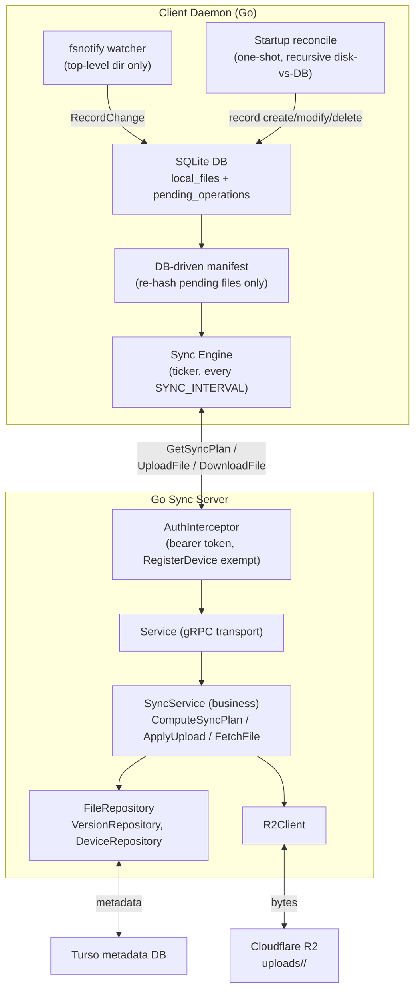

# Data Sync

A self-hosted file storage and synchronization system similar to iCloud. Local-first clients on multiple machines, centralized durable storage in the cloud, and incremental sync that works offline.

## Architecture

## How it works

- **Client** watches a folder with fsnotify (top-level directory only). Every event is written to a local SQLite DB (`local_files` + `pending_operations`) as a create/modify/delete op, along with the file's size and SHA-256 hash.
- At **startup** a one-shot, recursive reconcile walks disk vs DB to catch anything the watcher missed while the process was down.
- On every **sync pass** the client builds a *DB-driven manifest* (re-hashing only files with pending ops), sends it to the server, and executes the returned plan. A file with a pending local edit is always **uploaded, never overwritten** by a download (client-push-wins).
- **Server** computes the plan by comparing the client's manifest against Turso metadata (indexed path + head-version lookups). Bytes go to R2 under a content-addressed layout, so old versions are never destroyed. Upload is streamed whole-file (chunking is a post-MVP TODO); download is streamed and written atomically (temp file + rename).

## Current scope / known gaps

- Whole-file transfer; chunked upload + resumable is deferred.
- Last-writer-wins; proper conflict detection is deferred (metadata for it is already reserved).
- **Deletions are not propagated** - the server never emits DELETE actions, and deleted local files are excluded from the manifest. Because the plan pulls every server file a client is missing, a locally deleted file is re-downloaded on the next pass. Cross-device delete awaits a tombstone/op design.
- Watcher is top-level only; subdirectories are covered by the startup reconcile and are tracked in TODO for recursive watching.
- gRPC calls are authenticated with per-device bearer tokens (server-side interceptor).
