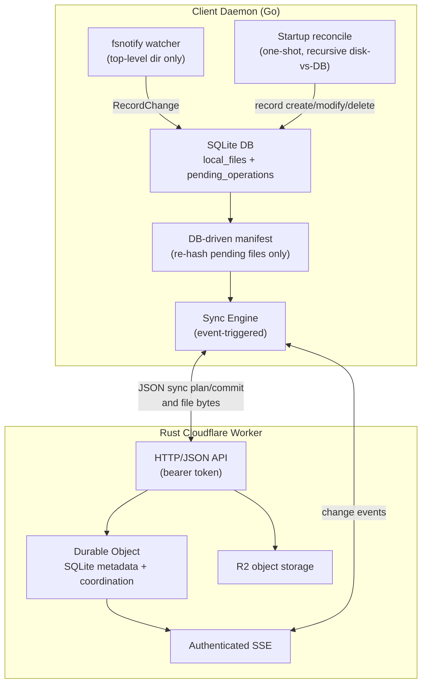

# Data Sync

A self-hosted file storage and synchronization system similar to iCloud. Local-first clients on multiple machines, centralized durable storage in the cloud, and incremental sync that works offline.

## Architecture

```mermaid
flowchart TB
    subgraph Client["Client Daemon (Go)"]
        Watcher["fsnotify watcher<br/>(top-level dir only)"]
        Reconcile["Startup reconcile<br/>(one-shot, recursive disk-vs-DB)"]
        LocalDB["SQLite DB<br/>local_files + pending_operations"]
        Manifest["DB-driven manifest<br/>(re-hash pending files only)"]
        SyncEngine["Sync Engine<br/>(event-triggered)"]

        Watcher -->|"RecordChange"| LocalDB
        Reconcile -->|"record create/modify/delete"| LocalDB
        LocalDB --> Manifest
        Manifest --> SyncEngine
    end

    subgraph Worker["Rust Cloudflare Worker"]
        API["HTTP/JSON API<br/>(bearer token)"]
        DurableObject["Durable Object<br/>SQLite metadata + coordination"]
        R2Client["R2 object storage"]
        Events["Authenticated SSE"]

        API --> DurableObject
        API --> R2Client
        DurableObject --> Events
    end

    SyncEngine <-->|"JSON sync plan/commit<br/>and file bytes"| API
    SyncEngine <-->|"change events"| Events
```

## How it works

- **Client** watches a folder recursively with fsnotify. Every event is written to a local SQLite DB (`local_files` + `pending_operations`) as a create/modify/delete op, along with the file's size and SHA-256 hash.
- At **startup** a one-shot, recursive reconcile walks disk vs DB to catch anything the watcher missed while the process was down.
- On every **sync pass** (initially and after each local filesystem event) the client builds a *DB-driven manifest* (re-hashing only files with pending ops), sends it to the Worker, and executes the returned plan. A file with a pending local edit is always **uploaded, never overwritten** by a download or delete (client-push-wins).
- Local deletions are propagated explicitly: the client commits a delete operation to the Worker, which stores a tombstone in Durable Object SQLite. The Worker then tells other clients to DELETE it, never offers a tombstoned file as a download, and new devices never receive it.
- The **Rust Worker** computes the plan by comparing the client's manifest against Durable Object SQLite metadata. Bytes go to R2 under content-addressed keys, so files are immutable and deduplicated. Upload and download are whole-file HTTP transfers written atomically on the client.

## Current scope / known gaps

- Whole-file transfer; chunked upload + resumable is deferred.
- First-writer-wins conflict detection uses each client's `last_seen_hash`.
- Deletions propagate via Durable Object tombstones; tombstone garbage collection is deferred, so tombstones are kept forever.
- New directories are added to the watcher as they are created.
- HTTP API and SSE connections are authenticated with a bearer token.
