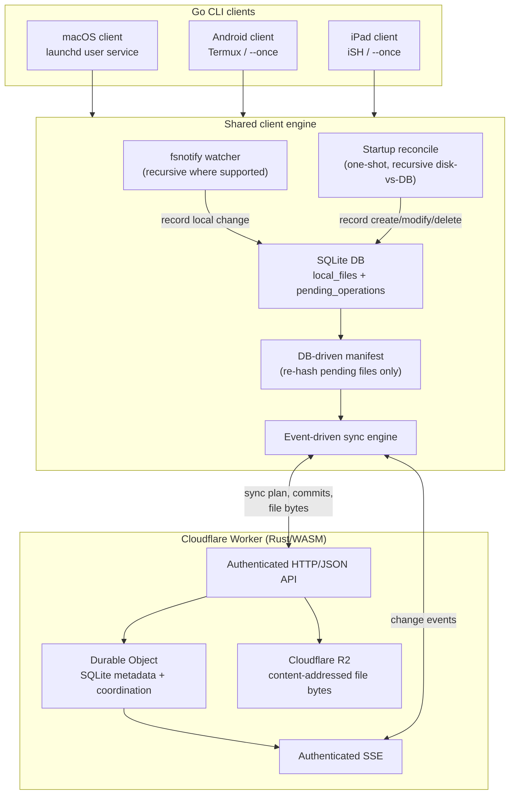

# Data Sync

A self-hosted file storage and synchronization system similar to iCloud. Local-first clients on multiple machines, centralized durable storage in the cloud, and incremental sync that works offline.

## Architecture


```mermaid
flowchart TB
    subgraph Clients["Go CLI clients"]
        Mac["macOS client<br/>launchd user service"]
        Android["Android client<br/>Termux / --once"]
        IPad["iPad client<br/>iSH / --once"]
    end

    subgraph Client["Shared client engine"]
        Watcher["fsnotify watcher<br/>(recursive where supported)"]
        Reconcile["Startup reconcile<br/>(one-shot, recursive disk-vs-DB)"]
        LocalDB["SQLite DB<br/>local_files + pending_operations"]
        Manifest["DB-driven manifest<br/>(re-hash pending files only)"]
        SyncEngine["Event-driven sync engine"]

        Watcher -->|"record local change"| LocalDB
        Reconcile -->|"record create/modify/delete"| LocalDB
        LocalDB --> Manifest
        Manifest --> SyncEngine
    end

    subgraph Worker["Cloudflare Worker (Rust/WASM)"]
        API["Authenticated HTTP/JSON API"]
        DurableObject["Durable Object<br/>SQLite metadata + coordination"]
        R2["Cloudflare R2<br/>content-addressed file bytes"]
        Events["Authenticated SSE"]

        API --> DurableObject
        API --> R2
        DurableObject --> Events
    end

    Mac --> Client
    Android --> Client
    IPad --> Client

    SyncEngine <-->|"sync plan, commits,<br/>file bytes"| API
    SyncEngine <-->|"change events"| Events
```

## How it works

- **Client** watches a folder recursively with fsnotify. Every event is written to a local SQLite DB (`local_files` + `pending_operations`) as a create/modify/delete op, along with the file's size and SHA-256 hash.
- At **startup** a one-shot, recursive reconcile walks disk vs DB to catch anything the watcher missed while the process was down.
- On every **sync pass** (initially and after each local filesystem event) the client builds a *DB-driven manifest* (re-hashing only files with pending ops), sends it to the Worker, and executes the returned plan. A file with a pending local edit is always **uploaded, never overwritten** by a download or delete (client-push-wins).
- Local deletions are propagated explicitly: the client commits a delete operation to the Worker, which stores a tombstone in Durable Object SQLite. The Worker then tells other clients to DELETE it, never offers a tombstoned file as a download, and new devices never receive it.
- The **Rust Worker** computes the plan by comparing the client's manifest against Durable Object SQLite metadata. Bytes go to R2 under content-addressed keys, so files are immutable and deduplicated. Upload and download are whole-file HTTP transfers written atomically on the client.
- After each accepted upload or delete commit, the Worker removes R2 objects that are no longer referenced by active metadata, so old file versions do not accumulate.

## Current scope / known gaps

- Whole-file transfer; chunked upload + resumable is deferred.
- First-writer-wins conflict detection uses each client's `last_seen_hash`.
- Deletions propagate via Durable Object tombstones; tombstone garbage collection is deferred, so tombstones are kept forever.
- New directories are added to the watcher as they are created.
- HTTP API and SSE connections are authenticated with a bearer token.

## Personal deployment and development notes

This section contains the setup instructions for my local development and
Cloudflare deployment workflow.

### Configure the client

From the repository root:

```sh
cp .env.example .env
```

Set the same dedicated random token in `.env` that is configured as the
Worker's `SYNC_TOKEN` secret:

```env
SYNC_HTTP=https://data-sync-cloudflare.shivang.workers.dev
SYNC_TOKEN=your-dedicated-sync-token
SYNC_FOLDER=./data
SYNC_DB=./data-sync.db
```

`.env` is ignored by Git. Never commit the token or reuse an account password
as the sync token.

### Run the client

The normal daemon watches the configured folder recursively. A local file
create, edit, or delete immediately triggers a sync. Remote changes trigger a
sync through authenticated SSE:

```sh
go run ./cmd/client
```

For a single reconciliation pass:

```sh
go run ./cmd/client --once
```

Equivalent Make targets:

```sh
make run-client
make run-client-once
make test
```

### Build mobile clients

The Android target builds a statically linked ARM64 binary for Android:

```sh
make build_android_client
```

The iPad target builds a Linux 386 binary for iSH, which runs a Linux
userspace on iPad:

```sh
make build_ipad_client
```

The generated binaries are written to:

```text
data/android/sync-client-arm64
data/ipad/sync-client-ipad
```

### Run the Worker locally

Run Wrangler from the repository root through the Makefile:

```sh
make worker-dev
```

Then temporarily use this endpoint in `.env`:

```env
SYNC_HTTP=http://localhost:8787
SYNC_TOKEN=dev-token
```

Check the local Worker:

```sh
curl http://localhost:8787/health
```

Expected response:

```text
ok
```

### Deploy the Worker

Authenticate Wrangler once:

```sh
wrangler login
```

Create the R2 bucket if it does not exist:

```sh
cd rust_server
wrangler r2 bucket create data-sync-files-v2
```

Configure the production token without placing it in source code:

```sh
wrangler secret put SYNC_TOKEN
```

Deploy:

```sh
make worker-deploy
```

The Worker configuration is in
[rust_server/wrangler.toml](./rust_server/wrangler.toml). The Worker uses
Durable Object SQLite for metadata and coordination, R2 for file bytes, and
authenticated SSE for change notifications.

### Inspect local development data

Wrangler stores local R2 and Durable Object state under:

```text
rust_server/.wrangler/state/v3/
```

The Durable Object SQLite files are under:

```text
rust_server/.wrangler/state/v3/do/
```

The directory is ignored by Git. Stop Wrangler before making manual changes to
its SQLite files.
