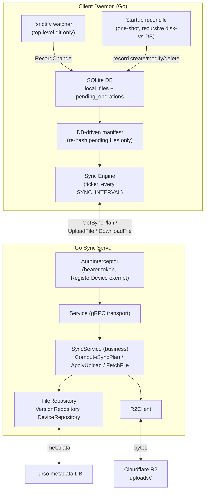

This is just an attempt to build a cli based tool to syncronize my files across my devices. It isn't that there are no existing solutions, there are giants like Google Drive, iCloud or Dropbox, then there are some P2P tools like Syncthing. There are also self hostable cloud options like NextCLoud and OwnCloud (I am not sure if they provide sync functionality though). The project is intended to be both - a fun learning project and serve my usecase of syncing files with my custom centralised storage backend (I have opted for client-server based architecture for now instead of P2P for simplicity). I am heavily utilizing OpenCode for building this project. I am trying it for the first time, it provides some decent coding models along with the options to connect with external APIs. Cloudflare R2 provides 10GB of free storage in their free tier, so that was the reason for going towards it. As for Turso for my metadata storage, I just find the project interesting, it is a fork of SQLite written in Rust (I mean libsql, on top of which Turso build their SaaS). They also have a pretty generous free tier(atleast for now).

The actual README for the project is here - [MAIN.md](./MAIN.md)

## Architecture

