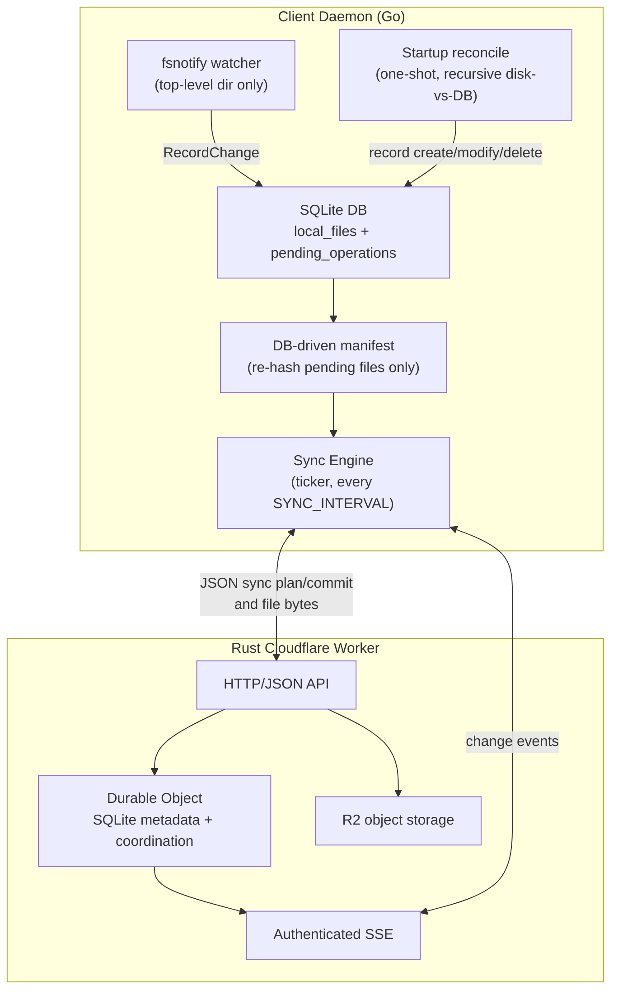

This is a CLI tool for synchronizing files across devices. The Go client talks to a Rust Cloudflare Worker over authenticated HTTP/JSON, stores file bytes in Cloudflare R2, keeps synchronization metadata in a Durable Object's SQLite database, and receives change notifications over SSE.

The actual README for the project is here - [MAIN.md](./MAIN.md)

## Architecture

```mermaid
flowchart TB
    subgraph Client["Client Daemon (Go)"]
        Watcher["fsnotify watcher<br/>(top-level dir only)"]
        Reconcile["Startup reconcile<br/>(one-shot, recursive disk-vs-DB)"]
        LocalDB["SQLite DB<br/>local_files + pending_operations"]
        Manifest["DB-driven manifest<br/>(re-hash pending files only)"]
        SyncEngine["Sync Engine<br/>(ticker, every SYNC_INTERVAL)"]

        Watcher -->|"RecordChange"| LocalDB
        Reconcile -->|"record create/modify/delete"| LocalDB
        LocalDB --> Manifest
        Manifest --> SyncEngine
    end

    subgraph Worker["Rust Cloudflare Worker"]
        API["HTTP/JSON API"]
        DurableObject["Durable Object<br/>SQLite metadata + coordination"]
        R2Client["R2 object storage"]
        Events["Authenticated SSE"]

        API --> DurableObject
        API --> R2Client
        DurableObject --> Events
    end

    SyncEngine <-->|"JSON sync plan/commit<br/>and file bytes"| API
    SyncEngine <-->|"change events"| Events
```

## License

Released under the [MIT License](./LICENSE). :)
