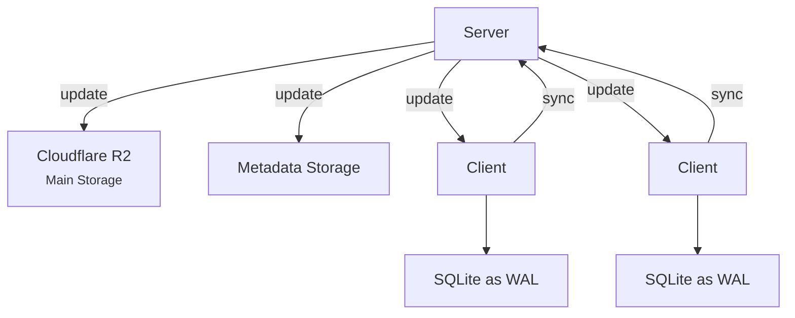

```mermaid
flowchart TB
    R2["Cloudflare R2<br/><small>Main Storage</small>"]
    META["Metadata Storage"]
    SERVER["Server"]

    C1["Client"]
    C2["Client"]

    DB1["SQLite as WAL"]
    DB2["SQLite as WAL"]

    SERVER -->|update| R2
    SERVER -->|update| META

    C1 -->|sync| SERVER
    SERVER -->|update| C1

    C2 -->|sync| SERVER
    SERVER -->|update| C2

    C1 --> DB1
    C2 --> DB2
```
