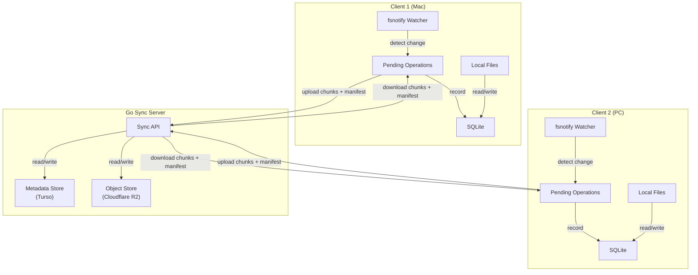

```mermaid
flowchart TB
    subgraph Client1["Client 1 (Mac)"]
        W1["fsnotify Watcher"]
        LFS1["Local Files"]
        PO1["Pending Operations"]
        DB1["SQLite"]
        
        W1 -->|detect change| PO1
        PO1 -->|record| DB1
        LFS1 -->|read/write| DB1
    end

    subgraph Client2["Client 2 (PC)"]
        W2["fsnotify Watcher"]
        LFS2["Local Files"]
        PO2["Pending Operations"]
        DB2["SQLite"]
        
        W2 -->|detect change| PO2
        PO2 -->|record| DB2
        LFS2 -->|read/write| DB2
    end

    subgraph Server["Go Sync Server"]
        API["Sync API"]
        META["Metadata Store<br/>(Turso)"]
        R2["Object Store<br/>(Cloudflare R2)"]
        
        API -->|read/write| META
        API -->|read/write| R2
    end

    PO1 -->|upload chunks + manifest| API
    API -->|download chunks + manifest| PO1
    
    PO2 -->|upload chunks + manifest| API
    API -->|download chunks + manifest| PO2
```
